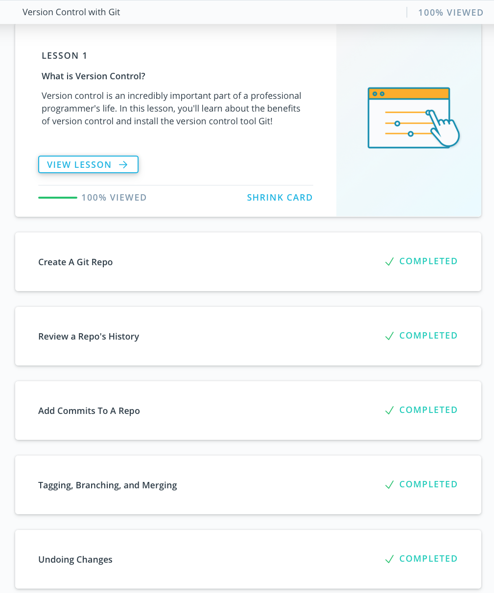
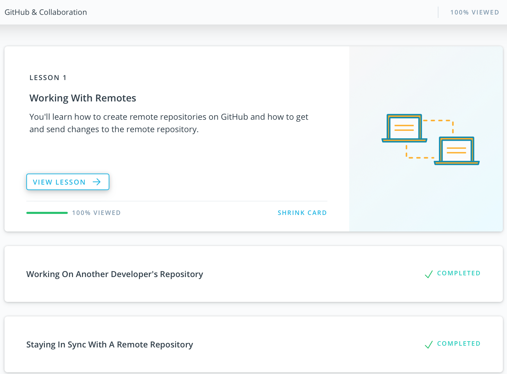
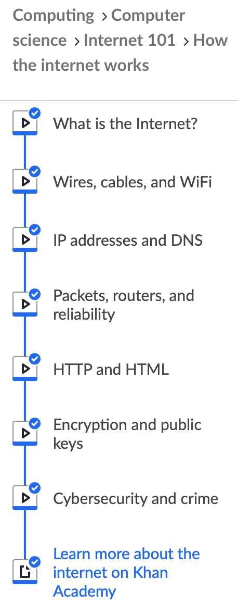

# Stage 0
1. [Git and GitHub](#1-git-and-github)
2. [Unix Shell](#2-unix-shell)
3. [Git Collaboration](#3-git-collaboration)
4. [Python Basics Part I](#4-python-basics-part-i)
5. [Memory management](#5-memory-management)
6. [TCP. UDP. Network](#6-tcp-udp-network)
7. [HTTP and HTTPS](#7-http-and-https)
8. [Design Patterns: Intro]()
9. [Data Structures]()
10. [File System](#10-file-system)
11. [Runtime, Ecosystem and I/O]()
12. [Databases](#12-relational-databases-basics)

## 1. Git and Github
I have gained new and expand existing knowledge of Git version control system. The Udacity course [Version Control with Git](https://www.udacity.com/course/how-to-use-git-and-github--ud775) was a good starting point and gave a good overview of basic Git usage (create a repo, commit changes, review the history of commits, etc). I learned new commands, how to use them and what information they provide for example:

`git log —oneline` list one commit per line, shows the first 7 characters of the commit’s SHA and the commit message;

`git log —stat` displays the file(s) that have been modified, the number of lines that have been added/removed and a summary line with the total number of modified files and lines that have been added/removed;

`git log -p` or `git log —patch` displays the files that have been modified, the location of the lines that have been added/removed and the actual changes that have been made;

`git tag` add a marker on a specific commit;

`git commit --amend` alter the most-recent commit;

`git revert` reverses given commit (you have to provide SHA).

Other materials help to further improve skills and can be used in the future.

## 2. Unix Shell

[Linux Survival](https://linuxsurvival.com/linux-tutorial-introduction/) completion:

| Quiz                               | End of module                       |
| ---------------------------------- | ----------------------------------- |
|[Quiz 1](task_unix_shell/quiz_1.png)|[Module 1](task_unix_shell/end_1.png)|
|[Quiz 2](task_unix_shell/quiz_2.png)|[Module 2](task_unix_shell/end_2.png)|
|[Quiz 3](task_unix_shell/quiz_3.png)|[Module 3](task_unix_shell/end_3.png)|
|[Quiz 4](task_unix_shell/quiz_4.png)|[Module 4](task_unix_shell/end_4.png)|

Notes from the learned materials:
* The command `cd` followed by nothing, will change the working directory to your home directory;
* Useful additional options for some commands, for example: `ls -a` shows hidden files, `ls -l` shows files in long format, `ls -hlt` shows files in human readable, long form and sorted by time;
* In unix there are three spheres of permission — user, group, and other — as well as three particular types for each sphere — read, write, and execute. Use `chmod` command to change the permission of a file or directory;
* `cat` command prints the contents of the files;
* [Unix pipeline](https://en.wikipedia.org/wiki/Pipeline_(Unix));
* `man` command shows the manual pages;
* I/O redirection: use `>` to send output to file or `>>` to append to file;
* `ps` command displays process information, `ps aux` shows all system processes;
* `grep` command searches for text in a file and returns the line(s) where it finds a match.

## 3. Git Collaboration
 

Notes from the learned materials:
* `git remote` command to manage and interact with the remote repository;
* `git push` command to send changes from local repository to remote;
* `git pull` retrieve updates from remote repository;
* `git fetch` retrieve commits from the remote repository branch but it *does not* automatically merge the local branch with the remote tracking branch. Use `git merge origin/master` to merge the local branch with the tracking branch;
* Use `git checkout` to move around and review commit history;
* Undo changes with `git revert` (preferred method for undoing public changes) and `git reset` (preferred method for undoing local private changes);
* `git shortlog` shows how many commits each contributor has added to the repository (`-s` to show just the number of commits and `-n` to sort them numerically);
* Use `--grep` flag with `git log` command to filter commits;
* Use `git rebase` to combine commits and modify history of a branch (use interactive mode `-i` and create a backup branch before rebasing).

>Follow best practices: *write clear and descriptive commit messages*; *create small, focused commits*; *update the README file*.

## 4. Python Basics Part I

[HackerRank profile](https://www.hackerrank.com/Mazart)

## 5. Memory Management
- What's going to happen if program reaches maximum limit of stack?
> The program receives a Segmentation Fault due to stack overflow.
- What's going to happen if program requests a big (more then 128KB) memory allocation on heap?
> Currently, the threshold is 128 KB: allocations smaller than or equal to 128 KB derive from the heap, whereas large allocations derive from anonymous memory mappings. In this case an anonymous memory mapping will be created to satisfy the allocation request.
- What's the difference between Text and Data memory segments?
> The **text memory segment** is read-only, not writable but executable. This memory stores all of your code and string literals. The **data memory segment** stores the contents for static variables initialized in source code and can be modified. This memory area is not anonymous.

```
==== Writable regions for process 615
REGION TYPE                      START - END             [ VSIZE  RSDNT  DIRTY   SWAP] PRT/MAX SHRMOD PURGE    REGION DETAIL
__DATA                 000000010de9d000-000000010deab000 [   56K    56K    56K     0K] rw-/rwx SM=COW          /bin/bash
Kernel Alloc Once      000000010deb5000-000000010deb7000 [    8K     4K     4K     0K] rw-/rwx SM=COW          
MALLOC metadata        000000010deb8000-000000010deb9000 [    4K     4K     4K     0K] rw-/rwx SM=COW          
MALLOC metadata        000000010deba000-000000010debe000 [   16K    16K    16K     0K] rw-/rwx SM=COW          
MALLOC metadata        000000010dec0000-000000010dec4000 [   16K    16K    16K     0K] rw-/rwx SM=COW          
MALLOC_LARGE           000000010dec6000-000000010dee1000 [  108K   108K   108K     0K] rw-/rwx SM=COW          DefaultMallocZone_0x10deb7000
__DATA                 000000010dfe1000-000000010e01a000 [  228K    28K    28K     0K] rw-/rwx SM=COW          /usr/lib/dyld
MALLOC_TINY            00007fc94fc00000-00007fc950000000 [ 4096K   184K   184K     0K] rw-/rwx SM=COW          DefaultMallocZone_0x10deb7000
MALLOC_SMALL           00007fc950000000-00007fc951800000 [ 24.0M   176K   176K     0K] rw-/rwx SM=COW          DefaultMallocZone_0x10deb7000
MALLOC_SMALL (empty)   00007fc951800000-00007fc952000000 [ 8192K    12K    12K     0K] rw-/rwx SM=COW          DefaultMallocZone_0x10deb7000
Stack                  00007ffee15e5000-00007ffee1de5000 [ 8192K    28K    28K     0K] rw-/rwx SM=COW          thread 0
__DATA                 00007fffa2143000-00007fffa2144000 [    4K     4K     0K     0K] rw-/rwx SM=COW          /usr/lib/libSystem.B.dylib
__DATA                 00007fffa216f000-00007fffa2177000 [   32K    32K    12K     0K] rw-/rwx SM=COW          /usr/lib/libc++.1.dylib
__DATA                 00007fffa2177000-00007fffa217b000 [   16K    12K     4K     0K] rw-/rwx SM=COW          /usr/lib/libc++abi.dylib
__DATA                 00007fffa2452000-00007fffa2456000 [   16K     8K     4K     0K] rw-/rwx SM=COW          /usr/lib/libncurses.5.4.dylib
__DATA                 00007fffa25ef000-00007fffa277c000 [ 1588K   720K    32K     0K] rw-/rwx SM=COW          /usr/lib/libobjc.A.dylib
__DATA                 00007fffa29ec000-00007fffa29ed000 [    4K     4K     0K     0K] rw-/rwx SM=COW          /usr/lib/system/libcache.dylib
__DATA                 00007fffa29ed000-00007fffa29ef000 [    8K     8K     0K     0K] rw-/rwx SM=COW          /usr/lib/system/libcommonCrypto.dylib
__DATA                 00007fffa29ef000-00007fffa29f1000 [    8K     4K     0K     0K] rw-/rwx SM=COW          /usr/lib/system/libcompiler_rt.dylib
__DATA                 00007fffa29f1000-00007fffa29f2000 [    4K     4K     0K     0K] rw-/rwx SM=COW          /usr/lib/system/libcopyfile.dylib
__DATA                 00007fffa29f2000-00007fffa29fb000 [   36K    32K     4K     0K] rw-/rwx SM=COW          /usr/lib/system/libcorecrypto.dylib
__DATA                 00007fffa2a05000-00007fffa2a1e000 [  100K    56K    16K     0K] rw-/rwx SM=COW          /usr/lib/system/libdispatch.dylib
__DATA                 00007fffa2a1e000-00007fffa2a22000 [   16K    16K     8K     0K] rw-/rwx SM=COW          /usr/lib/system/libdyld.dylib
__DATA                 00007fffa2a22000-00007fffa2a23000 [    4K     4K     0K     0K] rw-/rwx SM=COW          /usr/lib/system/libkeymgr.dylib
__DATA                 00007fffa2a24000-00007fffa2a25000 [    4K     4K     0K     0K] rw-/rwx SM=COW          /usr/lib/system/libmacho.dylib
__DATA                 00007fffa2a25000-00007fffa2a26000 [    4K     4K     0K     0K] rw-/rwx SM=COW          /usr/lib/system/libquarantine.dylib
__DATA                 00007fffa2a26000-00007fffa2a27000 [    4K     4K     0K     0K] rw-/rwx SM=COW          /usr/lib/system/libremovefile.dylib
__DATA                 00007fffa2a27000-00007fffa2a29000 [    8K     8K     0K     0K] rw-/rwx SM=COW          /usr/lib/system/libsystem_asl.dylib
__DATA                 00007fffa2a29000-00007fffa2a2a000 [    4K     4K     4K     0K] rw-/rwx SM=COW          /usr/lib/system/libsystem_blocks.dylib
__DATA                 00007fffa2a2a000-00007fffa2a33000 [   36K    36K    20K     0K] rw-/rwx SM=COW          /usr/lib/system/libsystem_c.dylib
__DATA                 00007fffa2a33000-00007fffa2a34000 [    4K     4K     0K     0K] rw-/rwx SM=COW          /usr/lib/system/libsystem_configuration.dylib
__DATA                 00007fffa2a34000-00007fffa2a35000 [    4K     4K     0K     0K] rw-/rwx SM=COW          /usr/lib/system/libsystem_coreservices.dylib
__DATA                 00007fffa2a35000-00007fffa2a38000 [   12K     8K     0K     0K] rw-/rwx SM=COW          /usr/lib/system/libsystem_darwin.dylib
__DATA                 00007fffa2a38000-00007fffa2a39000 [    4K     4K     0K     0K] rw-/rwx SM=COW          /usr/lib/system/libsystem_dnssd.dylib
__DATA                 00007fffa2a39000-00007fffa2a3c000 [   12K    12K     8K     0K] rw-/rwx SM=COW          /usr/lib/system/libsystem_info.dylib
__DATA                 00007fffa2a3c000-00007fffa2a3f000 [   12K    12K     4K     0K] rw-/rwx SM=COW          /usr/lib/system/libsystem_kernel.dylib
__DATA                 00007fffa2a3f000-00007fffa2a40000 [    4K     4K     0K     0K] rw-/rwx SM=COW          /usr/lib/system/libsystem_m.dylib
__DATA                 00007fffa2a40000-00007fffa2a43000 [   12K    12K     8K     0K] rw-/rwx SM=COW          /usr/lib/system/libsystem_malloc.dylib
__DATA                 00007fffa2a43000-00007fffa2a45000 [    8K     8K     0K     0K] rw-/rwx SM=COW          /usr/lib/system/libsystem_networkextension.dylib
__DATA                 00007fffa2a45000-00007fffa2a46000 [    4K     4K     0K     0K] rw-/rwx SM=COW          /usr/lib/system/libsystem_notify.dylib
__DATA                 00007fffa2a46000-00007fffa2a47000 [    4K     4K     4K     0K] rw-/rwx SM=COW          /usr/lib/system/libsystem_platform.dylib
__DATA                 00007fffa2a47000-00007fffa2a49000 [    8K     4K     4K     0K] rw-/rwx SM=COW          /usr/lib/system/libsystem_pthread.dylib
__DATA                 00007fffa2a49000-00007fffa2a4a000 [    4K     4K     0K     0K] rw-/rwx SM=COW          /usr/lib/system/libsystem_sandbox.dylib
__DATA                 00007fffa2a4a000-00007fffa2a4b000 [    4K     4K     0K     0K] rw-/rwx SM=COW          /usr/lib/system/libsystem_secinit.dylib
__DATA                 00007fffa2a4b000-00007fffa2a4c000 [    4K     4K     0K     0K] rw-/rwx SM=COW          /usr/lib/system/libsystem_symptoms.dylib
__DATA                 00007fffa2a4c000-00007fffa2a4e000 [    8K     8K     4K     0K] rw-/rwx SM=COW          /usr/lib/system/libsystem_trace.dylib
__DATA                 00007fffa2a4e000-00007fffa2a4f000 [    4K     4K     0K     0K] rw-/rwx SM=COW          /usr/lib/system/libunwind.dylib
__DATA                 00007fffa2a4f000-00007fffa2a56000 [   28K    28K    12K     0K] rw-/rwx SM=COW          /usr/lib/system/libxpc.dylib
```
`Heap - 00007fc94fc00000-00007fc950000000`, `Stack - 00007ffee15e5000-00007ffee1de5000`, `MMS - 000000010dfe1000-000000010e01a000`.

Lots of new information about this task. I had to search and read more materials to answer the questions. I will use the command `ps -a` and the knowledge gained.

## 6. TCP. UDP. Network
 

Has improved understanding of how the Internet and the network work, has learned new terminology.

## 7. HTTP and HTTPS
#### Requests
User info:  
`curl https://api.github.com/users/Mazzart`  
User info with the headers received from server:  
`curl -i https://api.github.com/users/Mazzart`  
The list of gists starred by user:  
`curl --user "Mazzart" https://api.github.com/gists/starred`  
The repositories of "Kottans" organization:  
`curl -i https://api.github.com/orgs/kottans/repos`  
Create new issue in your repository:  
`curl -i -H 'Authorization: token ********' -d '{"title": "Test issue", "body": "Nice testing issue", "labels": ["testing"]}' https://api.github.com/repos/Mazzart/kottans-backend/issues`
#### Questions
1. Name at least three possible negative consequences of not using https:
>- personal data of users can be stolen;
>- users can receive modified information along the way (man-in-the-middle attack);
>- users cannot be sure that they are communicating with the right server.
2. Explain the main idea behind public key cryptography in few sentences:  
>There are two types of keys: private and public which work together. The public key can be shared and used to encrypt information. But only a person with the right private key can decrypt this information.
3. You are creating an application for pet clinic. You need to implement the following functionality:
- add new pet (including name, age, breed, owner`s name, medical history)
> endpoint: /pet_clinic/pets  
> POST body: {"name": "...", "age": ..., "breed": "...", "owner_name": "...", "medical_history": "..."}  
> Status: 201 (Created) on success with the pet_id in the response body or 400 (Bad Request) on fail

- search pet by name
> endpoint: /pet_clinic/pets?name=value  
> GET  
> Status: 200 (OK) on success with the pet info in the response body or 400 (Bad Request) on fail

- change name of an existing pet
> endpoint: /pet_clinic/pets/{pet_id}  
> PUT body: {"name": "new_name"}  
> Status: 200 (OK) on success or 400 (Bad Request) on fail

- add new info about pet's health
> endpoint: /pet_clinic/pets/{pet_id}  
> PUT body: {"health": "..."}  
> Status: 200 (OK) on success or 400 (Bad Request) on fail

- assign a pet to a particular doctor in the clinic
> endpoint: /pet_clinic/pets/{pet_id}  
> PUT body: {"doctor_id": ...}  
> Status: 200 (OK) on success or 400 (Bad Request) on fail

- register an appointment for a pet. This request should include info about pet, doctor and appointment date and time
> endpoint: /pet_clinic/pets/{pet_id}/appointments  
> POST body: {"pet_info": ..., "doctor_info": ..., "date": ..., "time": ...}  
> Status: 201 (Created) on success with the appointment_id in the response body or 400 (Bad Request) on fail

## 8. Architectural Patterns & Design Patterns

## 9. Data Structures

## 10. File System
[secret.txt](file_system/secret.txt)  
[file_system_task](file_system/file_system_task.py)

## 11. Runtime and Ecosystem

## 12. Relational Databases Basics
The SQL SELECT statement can be viewed in the [select.sql](sql_basics/select.sql) file.
